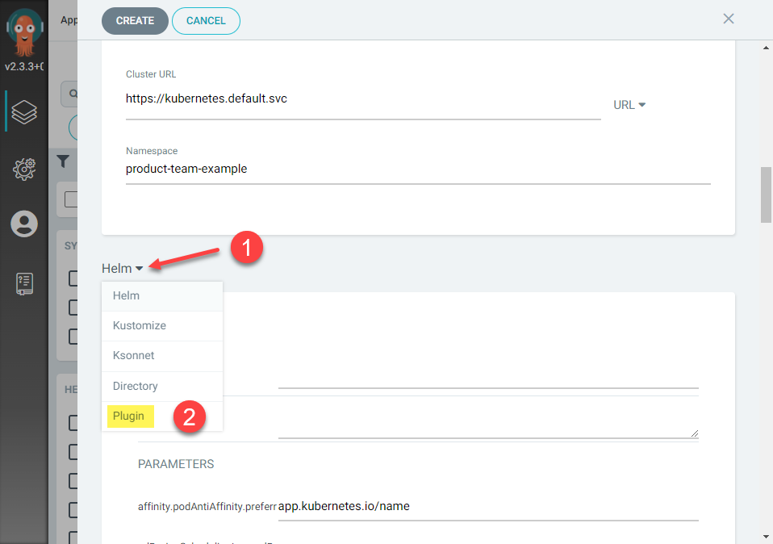
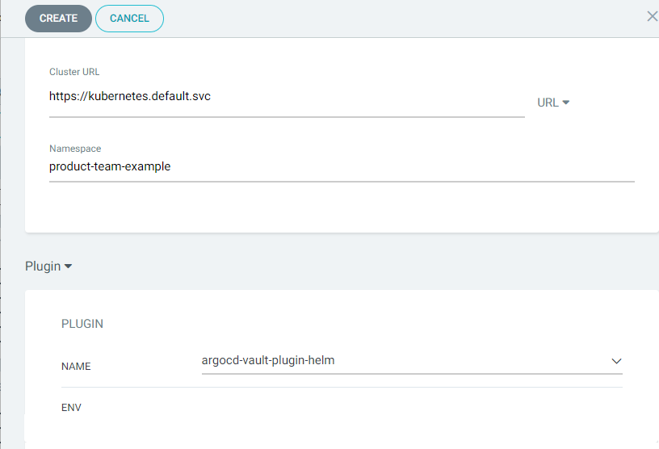

# How To Use Vault Secrets With ArgoCD

This guide is a small how-to about using secrets stored in HashiCorp Vault with your ArgoCD applications (with Helm
charts or Kustomize).

## tl;dr

To use vault secrets with your ArgoCD app, you have to

- store your secret inside your Vault tenant
- insert placeholders to app dependent files (ArgoCD App, helm, Kustomize, etc.)
- configure your ArgoCD application to use an ArgoCD Vault Plugin (AVP) using the _vault-secret_

For guidance of how to use Vault and store a secret inside Vault, please refer to
[How To Use Vault](../how-to-use-vault.md).

## Add Placeholder To Your Code

The AVP plugin use placeholders to recognize where you want to place a Vault secret value inside your code. Example
placeholder:

- `<placeholder>`
- `<path:some/path#secret-key>`
- `<path:some/path#secret-key#version>`

The secret path can alternatively be defined as annotation in manifest files instead of inside the placeholder.

### Examples

Placeholder with inline path:

```yaml
apiVersion: v1
kind: Secret
metadata:
  name: avp-example-secret
type: Opaque
stringData:
  //highlight-next-line
  foo: <path:product-team-example/data/hello#foo>
```

Placeholder and annotation for secret path:

```yaml
apiVersion: v1
kind: Secret
metadata:
  name: avp-example-secret
  annotations:
  //highlight-next-line
  avp.kubernetes.io/path: "product-team-example/data/hello"
type: Opaque
stringData:
  //highlight-next-line
  foo: <foo>
```

_Note_
When using annotation to specify the path to the secret inside vault, the placeholder represents only the key inside the
secret.

If you're using secrets from different paths within one file you must use placeholder with inline path definition, as
only one secret path can be provided by annotation.

Please keep in mind that the path must contain _data_ (e.g. `product-team-example/data/hello`) otherwise you'll get an
error message about _secret not found_ or similar.

_Tip_

As this project will be released with an open source scope, it is recommended to use placeholders with the inline path definition (as shown in example #1 above). When users want to install your stuff, it's not guaranteed that they're using ArgoCD with Vault plugin as we do (thus keeping it the most generic way possible).

You are not limited to use these placeholders inside manifest files, you can also use these inside helm specific file
like `values.yaml`:

```yaml
avp:
  helm:
    secretPath: <path:product-team-example/data/hello#foo>
```

And inside e.g. the helm templates you can reference like this:

```yaml
apiVersion: v1
kind: Secret
metadata:
  name: avp-example-path-secret
type: Opaque
stringData:
  foo: { { .Values.avp.helm.secretPath } }
```

_Tip_
Additional information about replacement behavior, placeholder types and more can be found
in [ArgoCD Vault Plugin Documentation](https://argocd-vault-plugin.readthedocs.io/en/stable/howitworks/).

## Configure The ArgoCD App To Use AVP

To enable your ArgoCD app to use the AVP plugin there is a mandatory step required:

- Configure the app to use one of the available AVP plugins

_Info Your Vault Secret_

The _vault-secret_ has been created for each product-team during onboarding.

In general your ArgoCD app manifest should look like this:

```yaml
apiVersion: argoproj.io/v1alpha1
kind: Application
metadata:
  name: my-argo-app
spec:
  project: project-name
  destination:
    server: https://kubernetes.default.svc
    namespace: project-name
  source:
    repoURL: https://github.com/catenax-ng/someRepo/
    targetRevision: HEAD
    path: path/to/app
    // highlight-getstarted
    plugin:
      name: argocd-vault-plugin
    // highlight-end
```

To configure your ArgoCD application to use an AVP plugin using the ArgoCD Web UI after the _Destination_ section you
have to select _Plugin_ from the dropdown selector, select the appropriate AVP plugin and enter the secret information:





### Use multiple helm values file when using AVP

Please read here if your application is using helm chart. If you use not only default `values.yaml`, but also provide an
additional value file. The priority will be given to the last (right-most) file specified. (see: [Helm Documentation](https://helm.sh/docs/helm/helm_install/)) Please use vault plugin `argocd-vault-plugin-helm-args` and configure it like the example:


To configure multiple `values.yaml` in App manifest, please refer
to [argocd-vault-plugin-helm-args](#argocd-vault-plugin-helm-args).

## Available ArgoCD Vault Plugins

For different approaches there are different ArgoCD Vault Plugins (AVP) available:

- _argocd-vault-plugin_
- _argocd-vault-plugin-helm_
- _argocd-vault-plugin-helm-args_
- _argocd-vault-plugin-kustomize_

### _argocd-vault-plugin_

Use this AVP plugin when your ArgoCD app is based on plain Kubernetes manifest files, and you want to pull secrets from
vault into your app.

The App manifest should contain:

```yaml
  plugin:
    //highlight-next-line
    name: argocd-vault-plugin
```

### _argocd-vault-plugin-helm_

Use this AVP plugin when your ArgoCD app is based on helm charts, and you want to pull secrets from vault into your app.

The App manifest should contain:

```yaml
  plugin:
    //highlight-next-line
    name: argocd-vault-plugin-helm
```

### _argocd-vault-plugin-helm-args_

Use this AVP plugin when your ArgoCD app is based on helm charts, but you have e.g. environment
specific `values-env.yaml` files to apply, and you want to pull secrets from vault into your app.

The App manifest should contain:

```yaml
  plugin:
    //highlight-next-line
    name: argocd-vault-plugin-helm-args
    env:
      //highlight-getstarted
      - name: helm_args
        value: '-f values.yaml -f values-env.yaml'
      //highlight-end
```

### _argocd-vault-plugin-kustomize_

Use this AVP plugin when your ArgoCD app is based on plain Kubernetes manifest files, and you want to pull secrets from
vault into your app.

The App manifest should contain:

```yaml
  plugin:
    //highlight-next-line
    name: argocd-vault-plugin-kustomize
```
